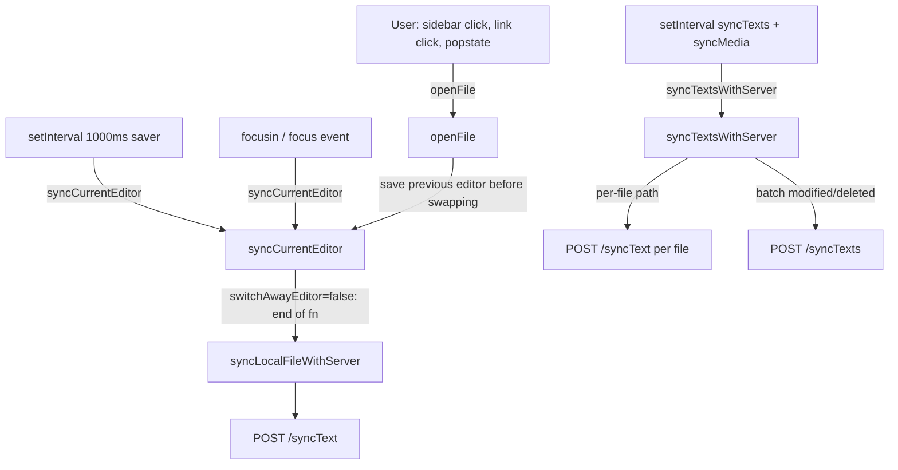
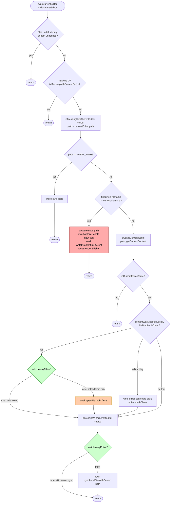

# Sync flow

How `openFile`, `syncCurrentEditor`, `syncTextsWithServer`, and `syncLocalFileWithServer` hand off work, and how the server knows what to send or receive.

## Triggers and who calls whom



The red node is the drift-seal line (files.js:1028). If `currentEditor` was rotated by anything during the yellow await above, this write lands on the wrong editor instance.

## syncCurrentEditor — both flag branches



The two green gates are the `switchAwayEditor` branches. The orange `Reload` is the one we neutralised (it used to recurse into `openFile` without an `el` arg and clobber the main editor). The red `Rename` block is the executioner that actually deletes and creates files on disk — still live, fires whenever first-line header disagrees with filename.

## Sync with the server — batch vs per-file

```mermaid
sequenceDiagram
    participant Client
    participant Server

    Note over Client: setInterval fires syncTextsWithServer
    Client->>Client: collectModifiedAndDeletedFiles<br/>(SKIPS editor.path and editor2.path)
    Client->>Server: POST /syncTexts { modified, deleted, timestamps }
    Note right of Client: modified = files whose<br/>disk mtime > lastClientSynced<br/>deleted = in server.files but not on disk<br/>timestamps = per-dir last-seen pointers

    Server-->>Client: { files: [path, content, lastModified, ...], timestamps, renames }
    Client->>Client: For each file in response:<br/>if path matches editor or editor2: skip<br/>else writeIfContentIsDifferent, update server.files
    Client->>Client: If nothing failed: move server.timestamps pointers forward

    Note over Client: --- meanwhile, currently-open files use per-file sync ---

    Note over Client: syncCurrentEditor ends<br/>(switchAwayEditor=false branch)
    Client->>Client: syncLocalFileWithServer path
    Client->>Server: POST /syncText { path, lastModified,<br/>clientLastModified, clientLastSynced, content }
    alt Server says notModified
        Server-->>Client: { status: notModified }
        Client->>Client: advance lastClientModified pointer only
    else Server says updatedOnServer
        Server-->>Client: { status: updatedOnServer, lastModified }
        Client->>Client: record server's lastModified; no disk write
    else Server merged or returned new content
        Server-->>Client: { status: merged or ok, content, lastModified }
        Client->>Client: writeIfContentIsDifferent; if path == editor.path: openFile path
    end
```

### How the server knows there's something to sync

Two mechanisms, running in parallel:

1. **Batch: `syncTextsWithServer` → `POST /syncTexts`.** The client sends:
   - `modified`: files whose disk `lastModified` is newer than the `lastClientSynced` pointer recorded in `server.files` for that path.
   - `deleted`: files present in the client's `server.files` snapshot but no longer on disk.
   - `timestamps`: a per-directory pointer telling the server "everything I've seen up to here." The server replies with files newer than each directory's pointer. **The two currently-open editor files are skipped on both send and receive** (`files.js:230` and `files.js:577`) — they're handled by the per-file path instead, to avoid racing with the user's active edits.

2. **Per-file: `syncLocalFileWithServer` → `POST /syncText`.** Called at the end of each `syncCurrentEditor` (when `switchAwayEditor=false`). Sends the single file's content plus its `lastModified` + `clientLastModified` + `clientLastSynced`. The server compares timestamps and responds with one of four statuses that the client maps to either "advance pointers only" or "write this content to disk."

The client's `server.files` object holds the triple `(content, lastModified, lastClientModified)` per path — this is the client's view of what the server thinks the world looks like, and the basis for deciding which files to include in the next `modified`/`deleted` lists. Persisted to `localStorage` under `SERVER_STORAGE_KEY`.

## Where the recent bug lived, in one sentence

The `switchAwayEditor` flag was added so that `syncCurrentEditor`, when called from `openFile`'s "save previous editor" path, does not take the orange `Reload` branch — the one that recursed into `openFile` without an `el`. That recursion used to rotate the global `currentEditor` under the outer `openFile`'s feet, which then wrote `.path` onto the wrong editor instance (the red node in the openFile diagram), producing a poisoned state that the red `Rename` block later turned into a destructive file duplication.
